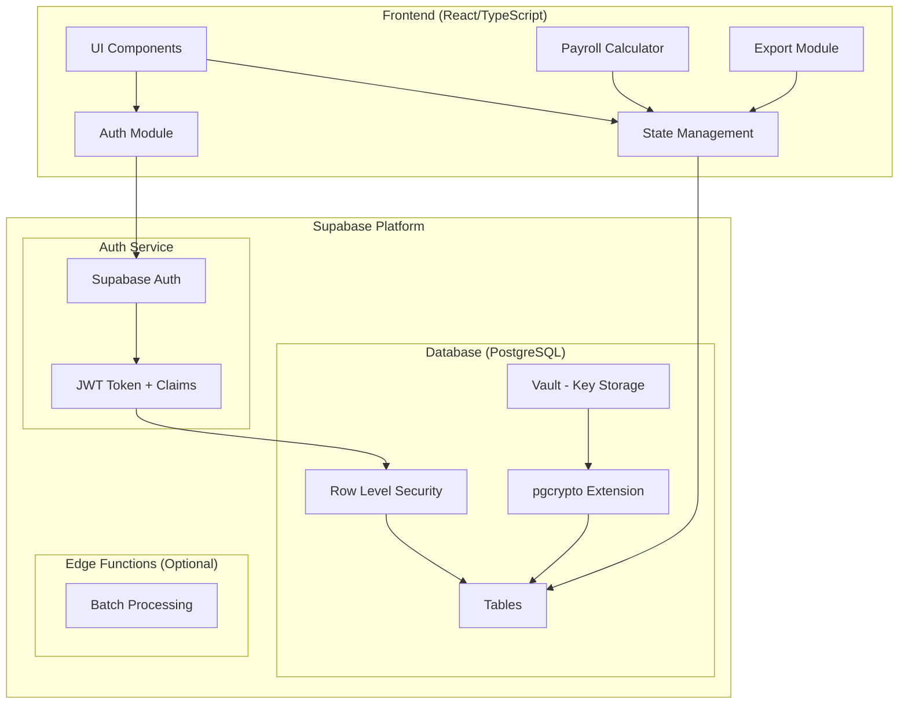
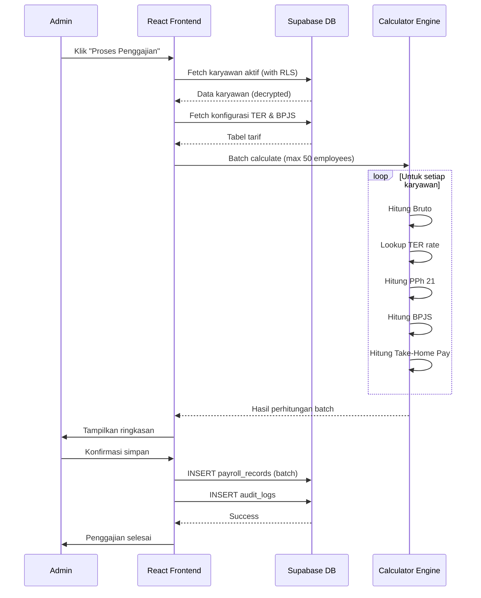
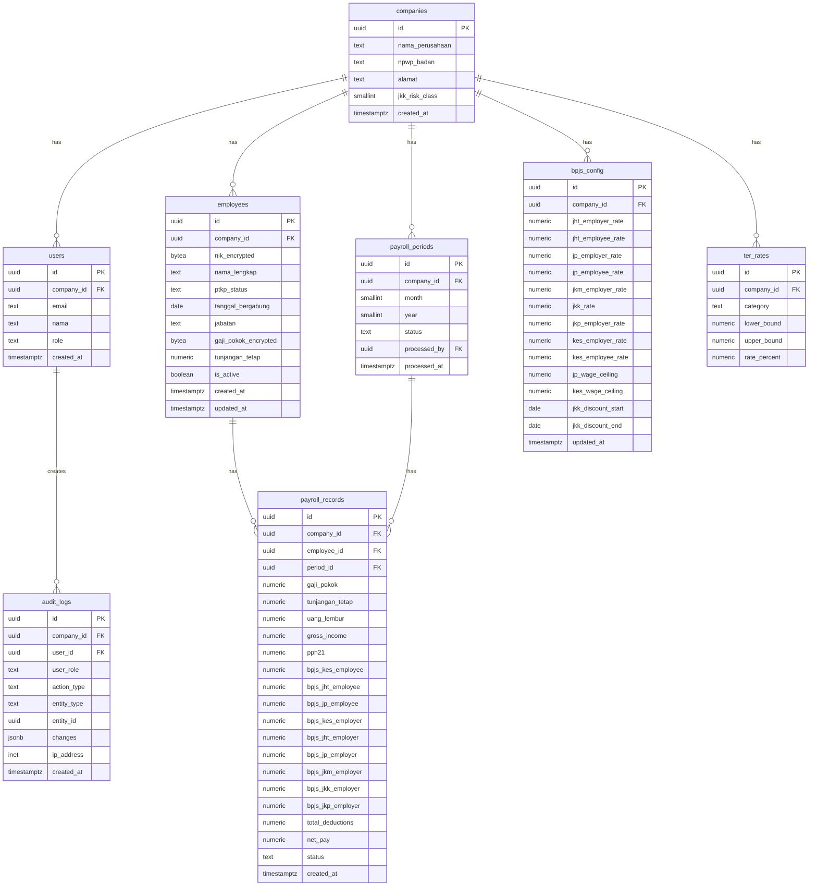

# Dokumen Desain Teknis: Tax-Ready Payroll

## Overview

Tax-Ready Payroll adalah aplikasi web Micro-SaaS berbasis React/TypeScript (frontend) dan Supabase/PostgreSQL (backend) yang dirancang untuk mengotomatisasi penggajian UMKM Indonesia. Sistem ini menghitung PPh 21 menggunakan skema TER, kalkulasi BPJS, dan menghasilkan dokumen ekspor kompatibel Coretax DJP.

### Keputusan Arsitektur Utama

| Keputusan | Pilihan | Alasan |
|-----------|---------|--------|
| Database | Supabase (PostgreSQL) | Managed service, built-in Auth, RLS, realtime |
| Multi-tenancy | Row Level Security (RLS) | Isolasi data di level database, bukan aplikasi |
| Enkripsi kolom | pgcrypto (pgp_sym_encrypt) | Extension bawaan Supabase, AES-256 compatible |
| Key management | Supabase Vault | Pisahkan kunci dari data terenkripsi |
| Frontend | React + TypeScript | Type safety, ekosistem luas, kompatibel Lovable |
| State management | React Context + TanStack Query | Ringan untuk skala MVP |
| PDF generation | @react-pdf/renderer (client) | Tanpa server tambahan, generate di browser |
| Export CSV/XML | Client-side generation | Tidak perlu backend tambahan untuk MVP |

---

## Architecture

### Diagram Arsitektur Sistem



### Diagram Alur Penggajian



### Strategi Perhitungan

Seluruh logika perhitungan PPh 21 dan BPJS dijalankan di **client-side** (browser) dengan alasan:
1. Data sudah di-fetch ke client melalui Supabase query
2. Perhitungan murni matematis tanpa side-effect
3. Menghindari biaya Edge Functions untuk MVP
4. Batch 50 karyawan dapat diproses < 1 detik di browser modern

Hasil perhitungan kemudian disimpan ke database sebagai `payroll_records`.

---

## Components and Interfaces

### Arsitektur Frontend (Folder Structure)

```
src/
├── app/
│   ├── App.tsx                    # Root component + routing
│   └── routes.tsx                 # Route definitions
├── components/
│   ├── ui/                        # Reusable UI primitives (Button, Input, Modal, Table)
│   ├── layout/
│   │   ├── Sidebar.tsx
│   │   ├── Header.tsx
│   │   └── ProtectedRoute.tsx     # RBAC guard
│   └── shared/
│       ├── LoadingSpinner.tsx
│       ├── ErrorBoundary.tsx
│       └── ConfirmDialog.tsx
├── features/
│   ├── auth/
│   │   ├── pages/
│   │   │   ├── LoginPage.tsx
│   │   │   └── RegisterCompanyPage.tsx
│   │   ├── hooks/
│   │   │   └── useAuth.ts
│   │   └── components/
│   │       └── LoginForm.tsx
│   ├── dashboard/
│   │   ├── pages/
│   │   │   └── DashboardPage.tsx
│   │   └── components/
│   │       ├── PayrollSummaryCard.tsx
│   │       └── RecentActivityList.tsx
│   ├── employees/
│   │   ├── pages/
│   │   │   ├── EmployeeListPage.tsx
│   │   │   └── EmployeeFormPage.tsx
│   │   ├── hooks/
│   │   │   └── useEmployees.ts
│   │   ├── components/
│   │   │   ├── EmployeeTable.tsx
│   │   │   ├── EmployeeForm.tsx
│   │   │   └── NIKValidationInput.tsx
│   │   └── validators/
│   │       └── employeeSchema.ts   # Zod schema
│   ├── payroll/
│   │   ├── pages/
│   │   │   ├── PayrollProcessPage.tsx
│   │   │   └── PayrollHistoryPage.tsx
│   │   ├── hooks/
│   │   │   └── usePayroll.ts
│   │   ├── components/
│   │   │   ├── PayrollBatchRunner.tsx
│   │   │   ├── PayrollResultTable.tsx
│   │   │   ├── PayrollSummary.tsx
│   │   │   └── ProgressIndicator.tsx
│   │   └── engine/
│   │       ├── pph21Calculator.ts      # PPh 21 TER logic
│   │       ├── bpjsCalculator.ts       # BPJS calculation logic
│   │       ├── netPayCalculator.ts     # Take-home pay
│   │       └── batchProcessor.ts       # Orchestrator
│   ├── export/
│   │   ├── pages/
│   │   │   └── ExportPage.tsx
│   │   ├── components/
│   │   │   ├── ExportFormatSelector.tsx
│   │   │   └── BPA1Generator.tsx
│   │   └── generators/
│   │       ├── csvGenerator.ts
│   │       ├── xmlGenerator.ts
│   │       └── pdfBPA1Generator.ts
│   ├── settings/
│   │   ├── pages/
│   │   │   └── SettingsPage.tsx
│   │   └── components/
│   │       ├── TERRateTable.tsx
│   │       ├── BPJSRateForm.tsx
│   │       └── UserRoleManager.tsx
│   └── audit/
│       ├── pages/
│       │   └── AuditTrailPage.tsx
│       └── components/
│           ├── AuditLogTable.tsx
│           └── AuditFilter.tsx
├── lib/
│   ├── supabase.ts                # Supabase client init
│   ├── encryption.ts              # Client-side masking helpers
│   └── constants.ts               # PTKP mappings, defaults
├── types/
│   ├── employee.ts
│   ├── payroll.ts
│   ├── bpjs.ts
│   └── auth.ts
└── utils/
    ├── formatCurrency.ts
    ├── dateUtils.ts
    └── validators.ts
```

### Daftar Halaman UI

| Halaman | Route | Akses |
|---------|-------|-------|
| Login | `/login` | Public |
| Register Company | `/register` | Public |
| Dashboard | `/dashboard` | Owner, HR Staff |
| Daftar Karyawan | `/employees` | Owner, HR Staff |
| Form Karyawan | `/employees/new`, `/employees/:id` | Owner, HR Staff |
| Proses Penggajian | `/payroll/process` | Owner, HR Staff |
| Riwayat Penggajian | `/payroll/history` | Owner, HR Staff |
| Ekspor Dokumen | `/export` | Owner, HR Staff |
| Pengaturan Tarif | `/settings` | Owner |
| Audit Trail | `/audit` | Owner |
| Profil Saya | `/profile` | Regular Staff |
| Slip Gaji Saya | `/my-payslips` | Regular Staff |

### Interface Kalkulator (TypeScript)

```typescript
// === PPh 21 Calculator Interface ===
interface TERRate {
  id: string;
  category: 'A' | 'B' | 'C';
  lower_bound: number;    // Batas bawah bruto (Rp)
  upper_bound: number;    // Batas atas bruto (Rp)
  rate_percent: number;   // Persentase TER (misal: 2.5)
}

interface PPh21Input {
  gross_income: number;       // Penghasilan bruto
  ptkp_status: PTKPStatus;   // Status PTKP karyawan
}

interface PPh21Result {
  ter_category: 'A' | 'B' | 'C';
  ter_rate_percent: number;
  pph21_amount: number;       // Hasil PPh 21 (dibulatkan ke bawah)
}

// === BPJS Calculator Interface ===
interface BPJSConfig {
  jht_employer_rate: number;      // default 3.7%
  jht_employee_rate: number;      // default 2%
  jp_employer_rate: number;       // default 2%
  jp_employee_rate: number;       // default 1%
  jkm_employer_rate: number;      // default 0.3%
  jkk_rate: number;               // 0.24% - 1.74% per company
  jkp_employer_rate: number;      // default 0.36%
  kesehatan_employer_rate: number; // default 4%
  kesehatan_employee_rate: number; // default 1%
  jp_wage_ceiling: number;         // Batas atas upah JP
  kesehatan_wage_ceiling: number;  // Batas atas upah Kesehatan
  jkk_discount_active: boolean;    // Diskon 50% JKK
}

interface BPJSInput {
  base_wage: number;          // Gaji Pokok + Tunjangan Tetap
  payroll_period: Date;       // Untuk cek diskon JKK
}

interface BPJSResult {
  employer: {
    jht: number;
    jp: number;
    jkm: number;
    jkk: number;
    jkp: number;
    kesehatan: number;
    total: number;
  };
  employee: {
    jht: number;
    jp: number;
    kesehatan: number;
    total: number;
  };
}

// === Batch Processor Interface ===
interface PayrollBatchInput {
  company_id: string;
  period_month: number;       // 1-12
  period_year: number;
  employees: EmployeePayrollData[];
}

interface EmployeePayrollData {
  employee_id: string;
  nama: string;
  nik: string;
  ptkp_status: PTKPStatus;
  gaji_pokok: number;
  tunjangan_tetap: number;
  uang_lembur: number;
}

interface PayrollBatchResult {
  success_count: number;
  failed_count: number;
  total_net_pay: number;
  results: PayrollEmployeeResult[];
  errors: PayrollError[];
}

interface PayrollEmployeeResult {
  employee_id: string;
  nama: string;
  gaji_pokok: number;
  tunjangan_tetap: number;
  uang_lembur: number;
  gross_income: number;
  pph21: number;
  bpjs_employee_total: number;
  bpjs_employer_total: number;
  total_deductions: number;
  net_pay: number;
  status: 'success' | 'warning' | 'failed';
  warning_message?: string;
}
```

---

## Data Models

### Entity Relationship Diagram



### Definisi Tabel SQL Lengkap

#### 1. Tabel `companies`

```sql
CREATE TABLE companies (
    id UUID PRIMARY KEY DEFAULT gen_random_uuid(),
    nama_perusahaan TEXT NOT NULL,
    npwp_badan TEXT NOT NULL UNIQUE,
    alamat TEXT,
    jkk_risk_class SMALLINT NOT NULL DEFAULT 1 CHECK (jkk_risk_class BETWEEN 1 AND 5),
    created_at TIMESTAMPTZ NOT NULL DEFAULT now()
);

-- RLS Policy
ALTER TABLE companies ENABLE ROW LEVEL SECURITY;

CREATE POLICY "companies_select" ON companies
    FOR SELECT USING (
        id IN (SELECT company_id FROM users WHERE id = auth.uid())
    );

CREATE POLICY "companies_update" ON companies
    FOR UPDATE USING (
        id IN (SELECT company_id FROM users WHERE id = auth.uid() AND role = 'owner')
    );
```

#### 2. Tabel `users` (RBAC)

```sql
CREATE TABLE users (
    id UUID PRIMARY KEY REFERENCES auth.users(id) ON DELETE CASCADE,
    company_id UUID NOT NULL REFERENCES companies(id),
    email TEXT NOT NULL,
    nama TEXT NOT NULL,
    role TEXT NOT NULL CHECK (role IN ('owner', 'hr_staff', 'regular_staff')),
    created_at TIMESTAMPTZ NOT NULL DEFAULT now()
);

-- RLS Policy
ALTER TABLE users ENABLE ROW LEVEL SECURITY;

CREATE POLICY "users_select_same_company" ON users
    FOR SELECT USING (
        company_id = (SELECT company_id FROM users WHERE id = auth.uid())
    );

CREATE POLICY "users_insert_owner" ON users
    FOR INSERT WITH CHECK (
        company_id = (SELECT company_id FROM users WHERE id = auth.uid() AND role = 'owner')
    );

CREATE POLICY "users_update_owner" ON users
    FOR UPDATE USING (
        company_id = (SELECT company_id FROM users WHERE id = auth.uid() AND role = 'owner')
    );
```

#### 3. Tabel `employees`

```sql
CREATE TABLE employees (
    id UUID PRIMARY KEY DEFAULT gen_random_uuid(),
    company_id UUID NOT NULL REFERENCES companies(id),
    nik_encrypted BYTEA NOT NULL,           -- AES-256 encrypted
    nama_lengkap TEXT NOT NULL CHECK (char_length(nama_lengkap) <= 150),
    ptkp_status TEXT NOT NULL CHECK (ptkp_status IN (
        'TK/0','TK/1','TK/2','TK/3','K/0','K/1','K/2','K/3'
    )),
    tanggal_bergabung DATE NOT NULL,
    jabatan TEXT NOT NULL CHECK (char_length(jabatan) <= 100),
    gaji_pokok_encrypted BYTEA NOT NULL,    -- AES-256 encrypted
    tunjangan_tetap NUMERIC(15,0) NOT NULL DEFAULT 0 CHECK (tunjangan_tetap >= 0),
    is_active BOOLEAN NOT NULL DEFAULT true,
    created_at TIMESTAMPTZ NOT NULL DEFAULT now(),
    updated_at TIMESTAMPTZ NOT NULL DEFAULT now()
);

-- RLS Policy: hanya company sendiri
ALTER TABLE employees ENABLE ROW LEVEL SECURITY;

CREATE POLICY "employees_select" ON employees
    FOR SELECT USING (
        company_id = (SELECT company_id FROM users WHERE id = auth.uid())
    );

CREATE POLICY "employees_insert" ON employees
    FOR INSERT WITH CHECK (
        company_id = (SELECT company_id FROM users WHERE id = auth.uid())
        AND (SELECT role FROM users WHERE id = auth.uid()) IN ('owner', 'hr_staff')
    );

CREATE POLICY "employees_update" ON employees
    FOR UPDATE USING (
        company_id = (SELECT company_id FROM users WHERE id = auth.uid())
        AND (SELECT role FROM users WHERE id = auth.uid()) IN ('owner', 'hr_staff')
    );

CREATE POLICY "employees_delete" ON employees
    FOR DELETE USING (
        company_id = (SELECT company_id FROM users WHERE id = auth.uid())
        AND (SELECT role FROM users WHERE id = auth.uid()) = 'owner'
    );

-- Fungsi enkripsi/dekripsi menggunakan pgcrypto
CREATE OR REPLACE FUNCTION encrypt_value(plain_text TEXT, encryption_key TEXT)
RETURNS BYTEA AS $$
BEGIN
    RETURN pgp_sym_encrypt(plain_text, encryption_key);
END;
$$ LANGUAGE plpgsql SECURITY DEFINER;

CREATE OR REPLACE FUNCTION decrypt_value(encrypted_data BYTEA, encryption_key TEXT)
RETURNS TEXT AS $$
BEGIN
    RETURN pgp_sym_decrypt(encrypted_data, encryption_key);
END;
$$ LANGUAGE plpgsql SECURITY DEFINER;
```

#### 4. Tabel `ter_rates` (Konfigurasi Tarif TER)

```sql
CREATE TABLE ter_rates (
    id UUID PRIMARY KEY DEFAULT gen_random_uuid(),
    company_id UUID NOT NULL REFERENCES companies(id),
    category TEXT NOT NULL CHECK (category IN ('A', 'B', 'C')),
    lower_bound NUMERIC(15,0) NOT NULL CHECK (lower_bound >= 0),
    upper_bound NUMERIC(15,0) NOT NULL CHECK (upper_bound > 0),
    rate_percent NUMERIC(5,2) NOT NULL CHECK (rate_percent >= 0 AND rate_percent <= 100),
    CONSTRAINT valid_range CHECK (upper_bound > lower_bound)
);

ALTER TABLE ter_rates ENABLE ROW LEVEL SECURITY;

CREATE POLICY "ter_rates_select" ON ter_rates
    FOR SELECT USING (
        company_id = (SELECT company_id FROM users WHERE id = auth.uid())
    );

CREATE POLICY "ter_rates_manage_owner" ON ter_rates
    FOR ALL USING (
        company_id = (SELECT company_id FROM users WHERE id = auth.uid())
        AND (SELECT role FROM users WHERE id = auth.uid()) = 'owner'
    );
```

#### 5. Tabel `bpjs_config`

```sql
CREATE TABLE bpjs_config (
    id UUID PRIMARY KEY DEFAULT gen_random_uuid(),
    company_id UUID NOT NULL REFERENCES companies(id) UNIQUE,
    jht_employer_rate NUMERIC(5,2) NOT NULL DEFAULT 3.70,
    jht_employee_rate NUMERIC(5,2) NOT NULL DEFAULT 2.00,
    jp_employer_rate NUMERIC(5,2) NOT NULL DEFAULT 2.00,
    jp_employee_rate NUMERIC(5,2) NOT NULL DEFAULT 1.00,
    jkm_employer_rate NUMERIC(5,2) NOT NULL DEFAULT 0.30,
    jkk_rate NUMERIC(5,2) NOT NULL DEFAULT 0.24 CHECK (jkk_rate BETWEEN 0.24 AND 1.74),
    jkp_employer_rate NUMERIC(5,2) NOT NULL DEFAULT 0.36,
    kes_employer_rate NUMERIC(5,2) NOT NULL DEFAULT 4.00,
    kes_employee_rate NUMERIC(5,2) NOT NULL DEFAULT 1.00,
    jp_wage_ceiling NUMERIC(15,0) NOT NULL DEFAULT 10042300,
    kes_wage_ceiling NUMERIC(15,0) NOT NULL DEFAULT 12000000,
    jkk_discount_start DATE DEFAULT '2026-01-01',
    jkk_discount_end DATE DEFAULT '2026-06-30',
    updated_at TIMESTAMPTZ NOT NULL DEFAULT now()
);

ALTER TABLE bpjs_config ENABLE ROW LEVEL SECURITY;

CREATE POLICY "bpjs_config_select" ON bpjs_config
    FOR SELECT USING (
        company_id = (SELECT company_id FROM users WHERE id = auth.uid())
    );

CREATE POLICY "bpjs_config_update_owner" ON bpjs_config
    FOR UPDATE USING (
        company_id = (SELECT company_id FROM users WHERE id = auth.uid())
        AND (SELECT role FROM users WHERE id = auth.uid()) = 'owner'
    );
```

#### 6. Tabel `payroll_periods`

```sql
CREATE TABLE payroll_periods (
    id UUID PRIMARY KEY DEFAULT gen_random_uuid(),
    company_id UUID NOT NULL REFERENCES companies(id),
    month SMALLINT NOT NULL CHECK (month BETWEEN 1 AND 12),
    year SMALLINT NOT NULL CHECK (year >= 2024),
    status TEXT NOT NULL DEFAULT 'processed' CHECK (status IN ('processed', 'overwritten')),
    processed_by UUID NOT NULL REFERENCES users(id),
    processed_at TIMESTAMPTZ NOT NULL DEFAULT now(),
    CONSTRAINT unique_period_per_company UNIQUE (company_id, month, year)
);

ALTER TABLE payroll_periods ENABLE ROW LEVEL SECURITY;

CREATE POLICY "payroll_periods_select" ON payroll_periods
    FOR SELECT USING (
        company_id = (SELECT company_id FROM users WHERE id = auth.uid())
    );

CREATE POLICY "payroll_periods_insert" ON payroll_periods
    FOR INSERT WITH CHECK (
        company_id = (SELECT company_id FROM users WHERE id = auth.uid())
        AND (SELECT role FROM users WHERE id = auth.uid()) IN ('owner', 'hr_staff')
    );
```

#### 7. Tabel `payroll_records`

```sql
CREATE TABLE payroll_records (
    id UUID PRIMARY KEY DEFAULT gen_random_uuid(),
    company_id UUID NOT NULL REFERENCES companies(id),
    employee_id UUID NOT NULL REFERENCES employees(id),
    period_id UUID NOT NULL REFERENCES payroll_periods(id),
    gaji_pokok NUMERIC(15,0) NOT NULL,
    tunjangan_tetap NUMERIC(15,0) NOT NULL DEFAULT 0,
    uang_lembur NUMERIC(15,0) NOT NULL DEFAULT 0,
    gross_income NUMERIC(15,0) NOT NULL,
    pph21 NUMERIC(15,0) NOT NULL DEFAULT 0,
    bpjs_kes_employee NUMERIC(15,0) NOT NULL DEFAULT 0,
    bpjs_jht_employee NUMERIC(15,0) NOT NULL DEFAULT 0,
    bpjs_jp_employee NUMERIC(15,0) NOT NULL DEFAULT 0,
    bpjs_kes_employer NUMERIC(15,0) NOT NULL DEFAULT 0,
    bpjs_jht_employer NUMERIC(15,0) NOT NULL DEFAULT 0,
    bpjs_jp_employer NUMERIC(15,0) NOT NULL DEFAULT 0,
    bpjs_jkm_employer NUMERIC(15,0) NOT NULL DEFAULT 0,
    bpjs_jkk_employer NUMERIC(15,0) NOT NULL DEFAULT 0,
    bpjs_jkp_employer NUMERIC(15,0) NOT NULL DEFAULT 0,
    total_deductions NUMERIC(15,0) NOT NULL,
    net_pay NUMERIC(15,0) NOT NULL,
    status TEXT NOT NULL DEFAULT 'success' CHECK (status IN ('success', 'warning', 'failed')),
    warning_message TEXT,
    created_at TIMESTAMPTZ NOT NULL DEFAULT now()
);

ALTER TABLE payroll_records ENABLE ROW LEVEL SECURITY;

CREATE POLICY "payroll_records_select" ON payroll_records
    FOR SELECT USING (
        company_id = (SELECT company_id FROM users WHERE id = auth.uid())
    );

CREATE POLICY "payroll_records_insert" ON payroll_records
    FOR INSERT WITH CHECK (
        company_id = (SELECT company_id FROM users WHERE id = auth.uid())
        AND (SELECT role FROM users WHERE id = auth.uid()) IN ('owner', 'hr_staff')
    );
```

#### 8. Tabel `audit_logs`

```sql
CREATE TABLE audit_logs (
    id UUID PRIMARY KEY DEFAULT gen_random_uuid(),
    company_id UUID NOT NULL REFERENCES companies(id),
    user_id UUID NOT NULL REFERENCES users(id),
    user_role TEXT NOT NULL,
    action_type TEXT NOT NULL CHECK (action_type IN (
        'payroll_process', 'employee_create', 'employee_update', 'employee_delete',
        'salary_change', 'export_document', 'settings_change', 'role_change',
        'unauthorized_access'
    )),
    entity_type TEXT NOT NULL,
    entity_id UUID,
    changes JSONB,              -- {field: {old: x, new: y}}
    ip_address INET,
    created_at TIMESTAMPTZ NOT NULL DEFAULT now()
);

-- Immutable: hanya INSERT, tidak ada UPDATE/DELETE
ALTER TABLE audit_logs ENABLE ROW LEVEL SECURITY;

CREATE POLICY "audit_logs_select_owner" ON audit_logs
    FOR SELECT USING (
        company_id = (SELECT company_id FROM users WHERE id = auth.uid())
        AND (SELECT role FROM users WHERE id = auth.uid()) = 'owner'
    );

CREATE POLICY "audit_logs_insert" ON audit_logs
    FOR INSERT WITH CHECK (
        company_id = (SELECT company_id FROM users WHERE id = auth.uid())
    );

-- Tidak ada policy UPDATE/DELETE = immutable via RLS
-- Tambahan: revoke UPDATE/DELETE dari semua roles
REVOKE UPDATE, DELETE ON audit_logs FROM authenticated;
REVOKE UPDATE, DELETE ON audit_logs FROM service_role;
```

### Kebijakan Retensi Data

```sql
-- Partisi tabel audit_logs per tahun untuk manajemen retensi 5 tahun
-- Implementasi via pg_cron job (opsional untuk MVP, manual cleanup)
-- Data audit TIDAK BOLEH dihapus sebelum 5 tahun
```

---

## Alur Logika Backend / Fungsi (Low-Level Design)

### 1. PPh 21 TER Calculator — Pseudocode

```typescript
// File: src/features/payroll/engine/pph21Calculator.ts

type PTKPStatus = 'TK/0' | 'TK/1' | 'TK/2' | 'TK/3' | 'K/0' | 'K/1' | 'K/2' | 'K/3';

const PTKP_TO_TER_CATEGORY: Record<PTKPStatus, 'A' | 'B' | 'C'> = {
  'TK/0': 'A', 'TK/1': 'A', 'K/0': 'A',
  'TK/2': 'B', 'TK/3': 'B', 'K/1': 'B', 'K/2': 'B',
  'K/3': 'C',
};

function calculatePPh21(input: PPh21Input, terRates: TERRate[]): PPh21Result {
  // 1. Validasi input
  if (!PTKP_TO_TER_CATEGORY[input.ptkp_status]) {
    throw new ValidationError(`Status PTKP tidak valid: ${input.ptkp_status}`);
  }

  // 2. Jika bruto = 0, langsung return 0
  if (input.gross_income === 0) {
    return { ter_category: PTKP_TO_TER_CATEGORY[input.ptkp_status], ter_rate_percent: 0, pph21_amount: 0 };
  }

  // 3. Tentukan kategori TER dari status PTKP
  const category = PTKP_TO_TER_CATEGORY[input.ptkp_status];

  // 4. Cari tarif TER berdasarkan kategori dan rentang bruto
  const applicableRate = terRates.find(rate =>
    rate.category === category &&
    input.gross_income >= rate.lower_bound &&
    input.gross_income <= rate.upper_bound
  );

  if (!applicableRate) {
    throw new ValidationError(
      `Tarif TER tidak ditemukan untuk kategori ${category} dengan bruto Rp ${input.gross_income}`
    );
  }

  // 5. Hitung PPh 21 = Bruto × Persentase TER, bulatkan ke bawah (floor)
  const pph21Raw = input.gross_income * (applicableRate.rate_percent / 100);
  const pph21Amount = Math.floor(pph21Raw);

  return {
    ter_category: category,
    ter_rate_percent: applicableRate.rate_percent,
    pph21_amount: pph21Amount,
  };
}

function calculateGrossIncome(gajiPokok: number, tunjanganTetap: number, uangLembur: number): number {
  // Validasi: setiap komponen >= 0
  if (gajiPokok < 0 || tunjanganTetap < 0 || uangLembur < 0) {
    throw new ValidationError('Komponen gaji tidak boleh negatif');
  }
  return gajiPokok + tunjanganTetap + uangLembur;
}
```

### 2. BPJS Calculator — Pseudocode

```typescript
// File: src/features/payroll/engine/bpjsCalculator.ts

function calculateBPJS(input: BPJSInput, config: BPJSConfig): BPJSResult {
  const { base_wage, payroll_period } = input;

  // 1. Validasi
  if (base_wage <= 0) {
    throw new ValidationError('Upah dasar harus lebih dari 0');
  }

  // 2. Hitung BPJS Kesehatan (dengan ceiling)
  const kesWage = Math.min(base_wage, config.kesehatan_wage_ceiling);
  const kesEmployer = Math.round(kesWage * config.kes_employer_rate / 100);
  const kesEmployee = Math.round(kesWage * config.kes_employee_rate / 100);

  // 3. Hitung JHT (tanpa ceiling)
  const jhtEmployer = Math.round(base_wage * config.jht_employer_rate / 100);
  const jhtEmployee = Math.round(base_wage * config.jht_employee_rate / 100);

  // 4. Hitung JP (dengan ceiling)
  const jpWage = Math.min(base_wage, config.jp_wage_ceiling);
  const jpEmployer = Math.round(jpWage * config.jp_employer_rate / 100);
  const jpEmployee = Math.round(jpWage * config.jp_employee_rate / 100);

  // 5. Hitung JKM (pemberi kerja saja)
  const jkmEmployer = Math.round(base_wage * config.jkm_employer_rate / 100);

  // 6. Hitung JKK (dengan cek diskon 50%)
  let effectiveJKKRate = config.jkk_rate;
  if (config.jkk_discount_active && isWithinDiscountPeriod(payroll_period, config)) {
    effectiveJKKRate = config.jkk_rate * 0.5;
  }
  const jkkEmployer = Math.round(base_wage * effectiveJKKRate / 100);

  // 7. Hitung JKP (pemberi kerja saja)
  const jkpEmployer = Math.round(base_wage * config.jkp_employer_rate / 100);

  return {
    employer: {
      jht: jhtEmployer,
      jp: jpEmployer,
      jkm: jkmEmployer,
      jkk: jkkEmployer,
      jkp: jkpEmployer,
      kesehatan: kesEmployer,
      total: jhtEmployer + jpEmployer + jkmEmployer + jkkEmployer + jkpEmployer + kesEmployer,
    },
    employee: {
      jht: jhtEmployee,
      jp: jpEmployee,
      kesehatan: kesEmployee,
      total: jhtEmployee + jpEmployee + kesEmployee,
    },
  };
}

function isWithinDiscountPeriod(period: Date, config: BPJSConfig): boolean {
  // Cek apakah periode payroll berada dalam rentang diskon JKK
  const periodDate = new Date(period.getFullYear(), period.getMonth(), 1);
  const discountStart = new Date(config.jkk_discount_start);
  const discountEnd = new Date(config.jkk_discount_end);
  return periodDate >= discountStart && periodDate <= discountEnd;
}
```

### 3. Batch Payroll Processor — Pseudocode

```typescript
// File: src/features/payroll/engine/batchProcessor.ts

async function processBatchPayroll(input: PayrollBatchInput, terRates: TERRate[], bpjsConfig: BPJSConfig): Promise<PayrollBatchResult> {
  const results: PayrollEmployeeResult[] = [];
  const errors: PayrollError[] = [];
  let totalNetPay = 0;

  // Fase 1: Validasi seluruh karyawan sebelum proses
  const validationErrors = validateAllEmployees(input.employees);
  if (validationErrors.length > 0) {
    throw new BatchValidationError(validationErrors);
  }

  // Fase 2: Proses perhitungan per karyawan
  for (const employee of input.employees) {
    try {
      // 2a. Hitung penghasilan bruto
      const grossIncome = calculateGrossIncome(
        employee.gaji_pokok,
        employee.tunjangan_tetap,
        employee.uang_lembur
      );

      // 2b. Hitung PPh 21
      const pph21Result = calculatePPh21(
        { gross_income: grossIncome, ptkp_status: employee.ptkp_status },
        terRates
      );

      // 2c. Hitung BPJS
      const baseWage = employee.gaji_pokok + employee.tunjangan_tetap;
      const payrollDate = new Date(input.period_year, input.period_month - 1, 1);
      const bpjsResult = calculateBPJS(
        { base_wage: baseWage, payroll_period: payrollDate },
        bpjsConfig
      );

      // 2d. Hitung gaji bersih
      const totalDeductions = pph21Result.pph21_amount + bpjsResult.employee.total;
      const netPay = grossIncome - totalDeductions;

      // 2e. Cek gaji negatif
      let status: 'success' | 'warning' = 'success';
      let warningMessage: string | undefined;
      if (netPay < 0) {
        status = 'warning';
        warningMessage = `Gaji bersih negatif (Rp ${netPay}). Perlu ditinjau.`;
      }

      const result: PayrollEmployeeResult = {
        employee_id: employee.employee_id,
        nama: employee.nama,
        gaji_pokok: employee.gaji_pokok,
        tunjangan_tetap: employee.tunjangan_tetap,
        uang_lembur: employee.uang_lembur,
        gross_income: grossIncome,
        pph21: pph21Result.pph21_amount,
        bpjs_employee_total: bpjsResult.employee.total,
        bpjs_employer_total: bpjsResult.employer.total,
        total_deductions: totalDeductions,
        net_pay: netPay,
        status,
        warning_message: warningMessage,
      };

      results.push(result);
      if (status === 'success') {
        totalNetPay += netPay;
      }

    } catch (error) {
      // Karyawan gagal: lanjutkan ke karyawan berikutnya
      errors.push({
        employee_id: employee.employee_id,
        nama: employee.nama,
        reason: error.message,
      });
    }
  }

  return {
    success_count: results.filter(r => r.status !== 'failed').length,
    failed_count: errors.length,
    total_net_pay: totalNetPay,
    results,
    errors,
  };
}

function validateAllEmployees(employees: EmployeePayrollData[]): ValidationError[] {
  const errors: ValidationError[] = [];

  for (const emp of employees) {
    // Validasi NIK: tepat 16 digit angka
    if (!isValidNIK(emp.nik)) {
      errors.push({ employee: emp.nama, field: 'NIK', message: 'NIK harus 16 digit angka' });
    }
    // Validasi PTKP
    if (!isValidPTKP(emp.ptkp_status)) {
      errors.push({ employee: emp.nama, field: 'PTKP', message: 'Status PTKP tidak valid' });
    }
    // Validasi gaji pokok
    if (emp.gaji_pokok < 100000 || emp.gaji_pokok > 999999999) {
      errors.push({ employee: emp.nama, field: 'Gaji Pokok', message: 'Gaji pokok harus antara Rp100.000 - Rp999.999.999' });
    }
  }

  return errors;
}

function isValidNIK(nik: string): boolean {
  return /^\d{16}$/.test(nik);
}

function isValidPTKP(status: string): boolean {
  const validStatuses = ['TK/0','TK/1','TK/2','TK/3','K/0','K/1','K/2','K/3'];
  return validStatuses.includes(status);
}
```

### 4. Export Generator — Pseudocode

```typescript
// File: src/features/export/generators/csvGenerator.ts

function generateCoretaxCSV(
  companyName: string,
  period: { month: number; year: number },
  records: PayrollRecord[]
): { filename: string; content: string } {
  // 1. Validasi pre-export
  const invalidRecords = records.filter(r => !isValidNIK(r.nik) || !r.nama_lengkap);
  if (invalidRecords.length > 0) {
    throw new ExportValidationError(invalidRecords);
  }

  // 2. Generate filename: [NamaPerusahaan]_[YYYY]_[MM].csv
  const monthStr = String(period.month).padStart(2, '0');
  const filename = `${sanitizeFilename(companyName)}_${period.year}_${monthStr}.csv`;

  // 3. Generate CSV content dengan field wajib Coretax
  const headers = ['NIK', 'Nama Lengkap', 'Penghasilan Bruto', 'PPh 21'];
  const rows = records.map(r => [r.nik, r.nama_lengkap, r.gross_income, r.pph21]);

  const content = [headers.join(','), ...rows.map(row => row.join(','))].join('\n');

  return { filename, content };
}

// File: src/features/export/generators/pdfBPA1Generator.ts

function generateBPA1Data(employee: PayrollRecord, company: Company, period: { month: number; year: number }): BPA1Data {
  return {
    nama_karyawan: employee.nama_lengkap,
    nik: employee.nik,
    ptkp_status: employee.ptkp_status,
    masa_pajak_bulan: period.month,
    masa_pajak_tahun: period.year,
    penghasilan_bruto: employee.gross_income,
    pph21: employee.pph21,
    nama_pemotong: company.nama_perusahaan,
    npwp_pemotong: company.npwp_badan,
  };
}
```

### 5. NIK Masking Function

```typescript
// File: src/lib/encryption.ts

function maskNIK(nik: string): string {
  // Tampilkan hanya 4 digit terakhir, sisanya di-mask dengan '*'
  if (nik.length !== 16) return '****************';
  return '************' + nik.slice(-4);
}
```

---

## Correctness Properties

*A property is a characteristic or behavior that should hold true across all valid executions of a system — essentially, a formal statement about what the system should do. Properties serve as the bridge between human-readable specifications and machine-verifiable correctness guarantees.*

### Property 1: Validasi NIK menerima hanya 16 digit angka

*For any* string input, fungsi `isValidNIK` SHALL mengembalikan `true` jika dan hanya jika string tersebut terdiri dari tepat 16 karakter dan seluruhnya adalah digit angka (0-9).

**Validates: Requirements 1.1, 1.2, 1.3**

### Property 2: Validasi field wajib karyawan mendeteksi semua field kosong

*For any* objek karyawan dengan satu atau lebih field wajib yang kosong/tidak valid, fungsi validasi SHALL mengidentifikasi dan melaporkan setiap field yang bermasalah tanpa melewatkan satupun.

**Validates: Requirements 1.5, 1.6**

### Property 3: Validasi batch pra-penggajian mendeteksi semua karyawan bermasalah

*For any* daftar karyawan aktif yang mengandung campuran data valid dan tidak valid, fungsi `validateAllEmployees` SHALL mengembalikan error untuk setiap karyawan yang memiliki NIK tidak valid atau field wajib kosong, dan tidak mengembalikan error untuk karyawan yang datanya valid.

**Validates: Requirements 1.7, 1.8, 11.3, 11.4**

### Property 4: Pemetaan PTKP ke kategori TER selalu konsisten

*For any* status PTKP yang valid, fungsi pemetaan SHALL mengembalikan kategori A untuk TK/0, TK/1, dan K/0; kategori B untuk TK/2, TK/3, K/1, dan K/2; serta kategori C untuk K/3.

**Validates: Requirements 2.2**

### Property 5: Perhitungan penghasilan bruto adalah penjumlahan komponen

*For any* nilai gaji pokok, tunjangan tetap, dan uang lembur yang masing-masing ≥ 0, fungsi `calculateGrossIncome` SHALL mengembalikan hasil yang sama persis dengan penjumlahan ketiga komponen tersebut.

**Validates: Requirements 2.4**

### Property 6: PPh 21 = floor(Bruto × Persentase TER)

*For any* penghasilan bruto > 0 dan status PTKP yang valid, fungsi `calculatePPh21` SHALL mengembalikan nilai PPh 21 yang sama dengan `Math.floor(gross_income * applicable_ter_rate / 100)`, di mana `applicable_ter_rate` ditentukan oleh kategori TER dan rentang bruto dari tabel tarif.

**Validates: Requirements 2.1, 2.5**

### Property 7: Perhitungan BPJS menerapkan ceiling dan diskon dengan benar

*For any* upah dasar dan konfigurasi BPJS yang valid:
- BPJS Kesehatan dihitung dari `min(upah, ceiling_kesehatan)` dengan tarif 4% employer dan 1% employee
- JP dihitung dari `min(upah, ceiling_jp)` dengan tarif 2% employer dan 1% employee
- JHT dihitung dari upah penuh dengan tarif 3.7% employer dan 2% employee
- JKK menerapkan diskon 50% jika periode berada dalam rentang diskon yang dikonfigurasi
- Semua hasil dibulatkan ke bilangan bulat terdekat

**Validates: Requirements 3.1, 3.2, 3.3, 3.4**

### Property 8: Formula gaji bersih = Bruto - PPh21 - BPJS karyawan

*For any* karyawan dengan data valid, fungsi perhitungan gaji bersih SHALL menghasilkan nilai `net_pay = gross_income - pph21 - bpjs_kesehatan_employee - bpjs_jht_employee - bpjs_jp_employee`, di mana setiap komponen dihitung sesuai aturan masing-masing.

**Validates: Requirements 4.1**

### Property 9: Gaji bersih negatif menghasilkan status warning

*For any* hasil perhitungan di mana total potongan melebihi penghasilan bruto, sistem SHALL menandai karyawan tersebut dengan status 'warning' dan menyertakan pesan peringatan.

**Validates: Requirements 4.4**

### Property 10: Batch processing fault tolerance — kegagalan parsial tidak menghentikan batch

*For any* batch karyawan yang mengandung campuran data valid dan tidak valid, batch processor SHALL berhasil menghitung untuk semua karyawan valid, melaporkan error untuk karyawan yang gagal, dan menghasilkan ringkasan di mana `success_count + failed_count = total_employees`.

**Validates: Requirements 4.6, 4.7**

### Property 11: Ekspor Coretax mengandung semua field wajib

*For any* kumpulan payroll records yang valid, file ekspor CSV/XML SHALL mengandung field NIK (16 digit), Nama Lengkap, Penghasilan Bruto, dan Potongan PPh 21 untuk setiap karyawan.

**Validates: Requirements 5.1, 5.2**

### Property 12: Penamaan file ekspor mengikuti konvensi

*For any* nama perusahaan dan periode (bulan, tahun), filename yang dihasilkan SHALL mengikuti format `[NamaPerusahaan]_[YYYY]_[MM].[ext]` di mana ext adalah csv atau xml.

**Validates: Requirements 5.4**

### Property 13: Enkripsi-dekripsi round-trip mempertahankan data asli

*For any* string plaintext (NIK atau nilai gaji), operasi `decrypt(encrypt(plaintext, key), key)` SHALL menghasilkan string yang identik dengan plaintext asli.

**Validates: Requirements 8.1**

### Property 14: Masking NIK hanya menampilkan 4 digit terakhir

*For any* NIK 16 digit yang valid, fungsi `maskNIK` SHALL menghasilkan string di mana 12 karakter pertama adalah karakter mask ('*') dan 4 karakter terakhir identik dengan 4 digit terakhir NIK asli.

**Validates: Requirements 8.7**

### Property 15: RBAC permission matrix konsisten dengan definisi peran

*For any* kombinasi (peran, resource, aksi), fungsi pengecekan izin SHALL mengembalikan `true` jika dan hanya jika kombinasi tersebut diizinkan sesuai matriks: Owner = akses penuh, HR Staff = baca/tulis karyawan + payroll + ekspor (tanpa hapus/settings/role), Regular Staff = hanya profil dan slip gaji sendiri.

**Validates: Requirements 9.2, 9.3, 9.4**

### Property 16: Invariant minimal satu Owner per perusahaan

*For any* operasi yang mencoba menghapus atau menurunkan peran Owner terakhir dalam sebuah perusahaan, sistem SHALL menolak operasi tersebut.

**Validates: Requirements 9.7**

### Property 17: Audit log entry mengandung semua field wajib

*For any* aksi yang memicu pencatatan audit, entri log yang dihasilkan SHALL mengandung: timestamp ISO 8601 dengan timezone, user_id, peran pengguna, jenis aksi, detail perubahan (field, nilai lama, nilai baru), dan alamat IP.

**Validates: Requirements 10.1, 10.2**

### Property 18: Deteksi periode penggajian duplikat

*For any* perusahaan yang sudah memiliki payroll record untuk periode (bulan, tahun) tertentu, percobaan memproses ulang periode yang sama SHALL menghasilkan peringatan duplikat.

**Validates: Requirements 11.2**

---

## Error Handling

### Strategi Error Handling

| Layer | Strategi | Contoh |
|-------|----------|--------|
| Validasi Input | Fail-fast dengan pesan spesifik | NIK bukan 16 digit → pesan error per field |
| Kalkulasi | Try-catch per karyawan, lanjutkan batch | Tarif TER tidak ditemukan → skip karyawan, catat error |
| Database | Transaction rollback + audit log | Gagal simpan → rollback, log error |
| Enkripsi | Abort operasi + security log | Gagal encrypt → batalkan save, catat di security log |
| Audit | Abort triggering operation | Gagal catat audit → batalkan operasi pemicu |
| Ekspor | Pre-validation sebelum generate | Data tidak valid → tampilkan daftar error, cegah ekspor |

### Error Types

```typescript
// Hierarki error classes
class AppError extends Error {
  constructor(message: string, public code: string) { super(message); }
}

class ValidationError extends AppError {
  constructor(message: string, public fields?: FieldError[]) {
    super(message, 'VALIDATION_ERROR');
  }
}

class BatchValidationError extends AppError {
  constructor(public errors: EmployeeValidationError[]) {
    super('Validasi batch gagal', 'BATCH_VALIDATION_ERROR');
  }
}

class EncryptionError extends AppError {
  constructor(message: string) {
    super(message, 'ENCRYPTION_ERROR');
  }
}

class AuditLogError extends AppError {
  constructor(message: string) {
    super(message, 'AUDIT_LOG_ERROR');
  }
}

class ExportValidationError extends AppError {
  constructor(public invalidRecords: InvalidExportRecord[]) {
    super('Data tidak memenuhi validasi Coretax', 'EXPORT_VALIDATION_ERROR');
  }
}
```

### Pola Transaksional (Audit + Operasi)

```typescript
async function executeWithAudit(operation: () => Promise<any>, auditData: AuditEntry): Promise<any> {
  // Gunakan Supabase transaction (via RPC atau batch)
  // 1. Jalankan operasi utama
  // 2. Catat audit log
  // Jika audit gagal → rollback operasi utama
  const { data, error } = await supabase.rpc('execute_audited_operation', {
    operation_data: operation,
    audit_entry: auditData,
  });

  if (error) {
    throw new AuditLogError('Operasi dibatalkan karena gagal mencatat audit');
  }

  return data;
}
```

---

## Testing Strategy

### Pendekatan Dual Testing

Sistem ini menggunakan dua pendekatan testing yang saling melengkapi:

1. **Property-Based Tests (PBT)** — Memverifikasi properti universal yang harus berlaku untuk semua input valid
2. **Unit Tests (Example-Based)** — Memverifikasi skenario spesifik, edge cases, dan integrasi

### Library dan Konfigurasi

| Aspek | Pilihan |
|-------|---------|
| Test Runner | Vitest |
| PBT Library | fast-check |
| Minimum Iterasi PBT | 100 per property |
| Coverage Target | ≥ 80% untuk modul kalkulasi |

### Struktur Test Files

```
tests/
├── properties/
│   ├── nikValidation.property.test.ts      # Property 1
│   ├── employeeValidation.property.test.ts # Property 2, 3
│   ├── ptkpMapping.property.test.ts        # Property 4
│   ├── grossIncome.property.test.ts        # Property 5
│   ├── pph21Calculator.property.test.ts    # Property 6
│   ├── bpjsCalculator.property.test.ts     # Property 7
│   ├── netPay.property.test.ts             # Property 8, 9
│   ├── batchProcessor.property.test.ts     # Property 10
│   ├── exportGenerator.property.test.ts    # Property 11, 12
│   ├── encryption.property.test.ts         # Property 13
│   ├── masking.property.test.ts            # Property 14
│   ├── rbac.property.test.ts              # Property 15, 16
│   └── auditLog.property.test.ts          # Property 17, 18
├── unit/
│   ├── pph21Calculator.test.ts            # Contoh spesifik perhitungan
│   ├── bpjsCalculator.test.ts            # Contoh spesifik BPJS
│   ├── batchProcessor.test.ts            # Edge cases batch
│   └── exportGenerator.test.ts           # Format output spesifik
└── integration/
    ├── rls.test.ts                        # Multi-tenant isolation
    ├── encryption.test.ts                 # End-to-end encrypt/decrypt
    └── auditImmutability.test.ts          # Audit log cannot be modified
```

### Konfigurasi PBT

```typescript
// vitest.config.ts
import { defineConfig } from 'vitest/config';

export default defineConfig({
  test: {
    include: ['tests/**/*.test.ts'],
    globals: true,
  },
});

// Contoh property test dengan tagging
import { fc } from 'fast-check';
import { describe, it, expect } from 'vitest';

describe('PPh 21 Calculator Properties', () => {
  it('Feature: tax-ready-payroll, Property 6: PPh 21 = floor(Bruto × Persentase TER)', () => {
    fc.assert(
      fc.property(
        fc.integer({ min: 1, max: 999999999 }),  // gross_income
        fc.constantFrom('TK/0','TK/1','TK/2','TK/3','K/0','K/1','K/2','K/3'),
        (grossIncome, ptkpStatus) => {
          const result = calculatePPh21({ gross_income: grossIncome, ptkp_status: ptkpStatus }, mockTERRates);
          const expectedRate = findApplicableRate(mockTERRates, ptkpStatus, grossIncome);
          const expected = Math.floor(grossIncome * expectedRate / 100);
          expect(result.pph21_amount).toBe(expected);
        }
      ),
      { numRuns: 100 }
    );
  });
});
```

### Unit Test Examples (Contoh Spesifik)

```typescript
// tests/unit/pph21Calculator.test.ts
describe('PPh 21 - Contoh Spesifik', () => {
  it('Karyawan TK/0 dengan gaji Rp 10.000.000 → PPh sesuai TER kategori A', () => {
    // Contoh: TER A untuk range 9.650.001 - 10.050.000 = 2%
    const result = calculatePPh21({ gross_income: 10000000, ptkp_status: 'TK/0' }, terRates);
    expect(result.pph21_amount).toBe(200000); // floor(10.000.000 * 2%)
  });

  it('Bruto Rp 0 → PPh 21 = Rp 0 tanpa lookup TER', () => {
    const result = calculatePPh21({ gross_income: 0, ptkp_status: 'TK/0' }, terRates);
    expect(result.pph21_amount).toBe(0);
  });
});
```

### Integration Tests

- **RLS Isolation**: Buat 2 company, login sebagai user company A, verifikasi tidak bisa akses data company B
- **Encryption E2E**: Simpan NIK terenkripsi, baca kembali, verifikasi dekripsi benar
- **Audit Immutability**: Coba UPDATE/DELETE pada audit_logs, verifikasi ditolak
- **Performance**: Proses batch 50 karyawan, ukur waktu < 30 detik
